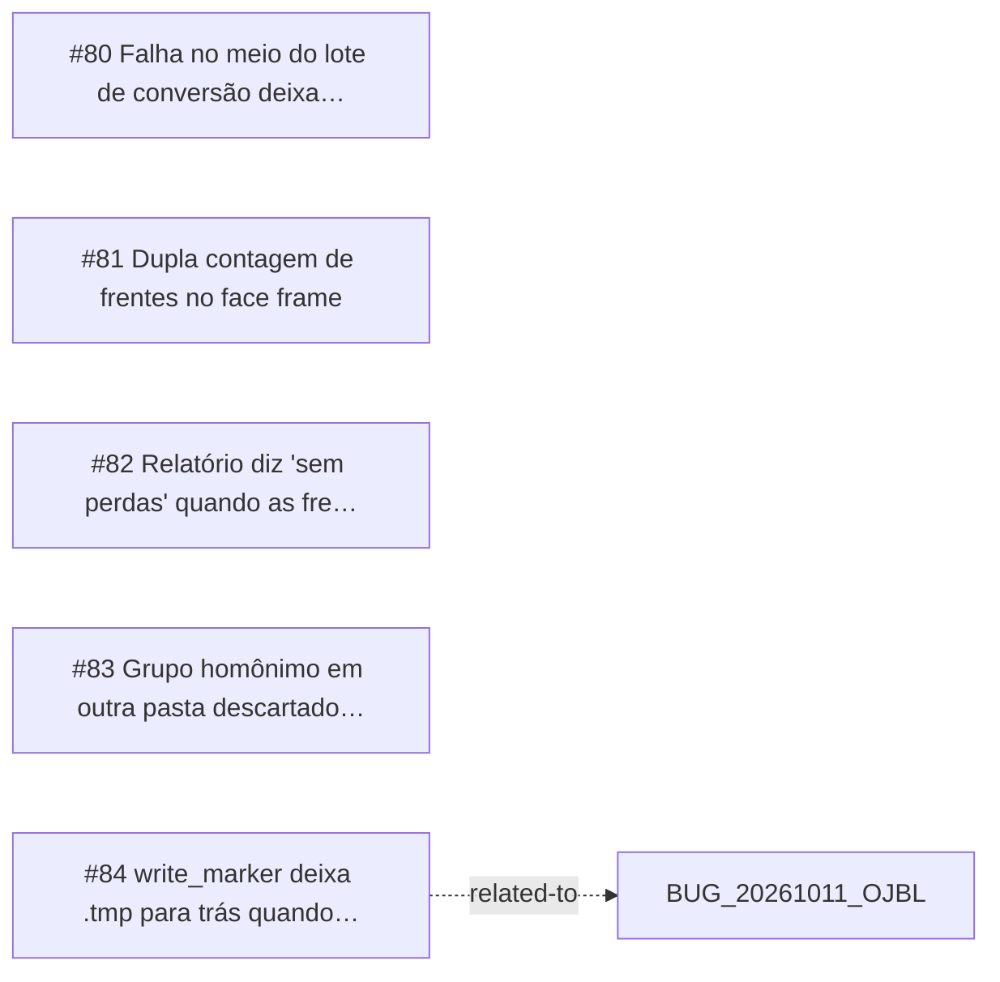

<!-- GENERATED, DO NOT EDIT: regenerado por /reversa-debugger-graph em 2026-11-24T06:45:20+00:00 a partir de 5 bugs -->

# Grafo · legacy

```mermaid
graph LR
  BUG_20261011_5NLX["#80 Falha no meio do lote de conversão deixa…"]
  BUG_20261011_NTM3["#81 Dupla contagem de frentes no face frame"]
  BUG_20261011_HUWF["#82 Relatório diz 'sem perdas' quando as fre…"]
  BUG_20261011_ORRG["#83 Grupo homônimo em outra pasta descartado…"]
  BUG_20261011_SWAD["#84 write_marker deixa .tmp para trás quando…"]
  BUG_20261011_SWAD -.->|related-to| BUG_20261011_OJBL
```

## Clusters

- `caffmob_draw/legacy/convert.py`: 2 bugs (BUG-20261011-5NLX, BUG-20261011-HUWF)
- `caffmob_draw/legacy/convert_core.py`: 2 bugs (BUG-20261011-NTM3, BUG-20261011-HUWF)

Leitura: 2 bugs convergem em `caffmob_draw/legacy/convert.py`, o maior ponto de convergência do contexto. Nenhum bug aberto neste contexto: o cluster mostra onde as correções se acumularam.

## Impact score

Heurística de triagem (não substitui priority/severity): causados ×3, bloqueados ×2, regressões ×4, relacionados ×1 (no máximo 3 no total), só arestas supported/confirmed.

| # | ID | score |
|---|---|---|
