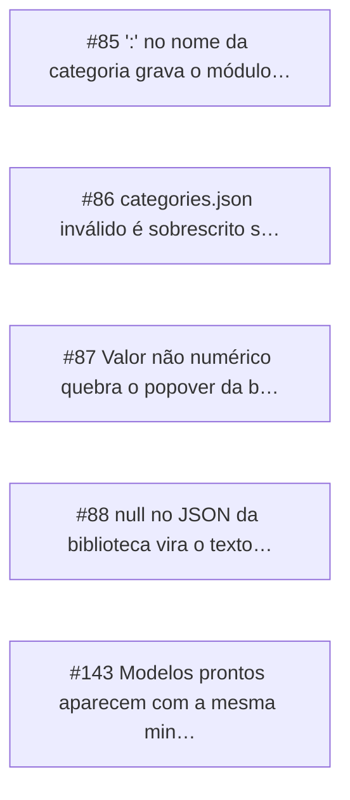

<!-- GENERATED, DO NOT EDIT: regenerado por /reversa-debugger-graph em 2026-11-24T06:45:20+00:00 a partir de 5 bugs -->

# Grafo · library_panel

```mermaid
graph LR
  BUG_20261011_3UWR["#85 ':' no nome da categoria grava o módulo…"]
  BUG_20261011_C7IK["#86 categories.json inválido é sobrescrito s…"]
  BUG_20261011_2HDG["#87 Valor não numérico quebra o popover da b…"]
  BUG_20261011_NCPI["#88 null no JSON da biblioteca vira o texto…"]
  BUG_20261014_RWU2["#143 Modelos prontos aparecem com a mesma min…"]
```

## Clusters

- `caffmob_draw/library_panel/categories_core.py`: 2 bugs (BUG-20261011-3UWR, BUG-20261011-NCPI)
- `caffmob_draw/library_panel/models_core.py`: 2 bugs (BUG-20261011-2HDG, BUG-20261011-NCPI)

Leitura: 2 bugs convergem em `caffmob_draw/library_panel/categories_core.py`, o maior ponto de convergência do contexto. Nenhum bug aberto neste contexto: o cluster mostra onde as correções se acumularam.

## Impact score

Heurística de triagem (não substitui priority/severity): causados ×3, bloqueados ×2, regressões ×4, relacionados ×1 (no máximo 3 no total), só arestas supported/confirmed.

| # | ID | score |
|---|---|---|
