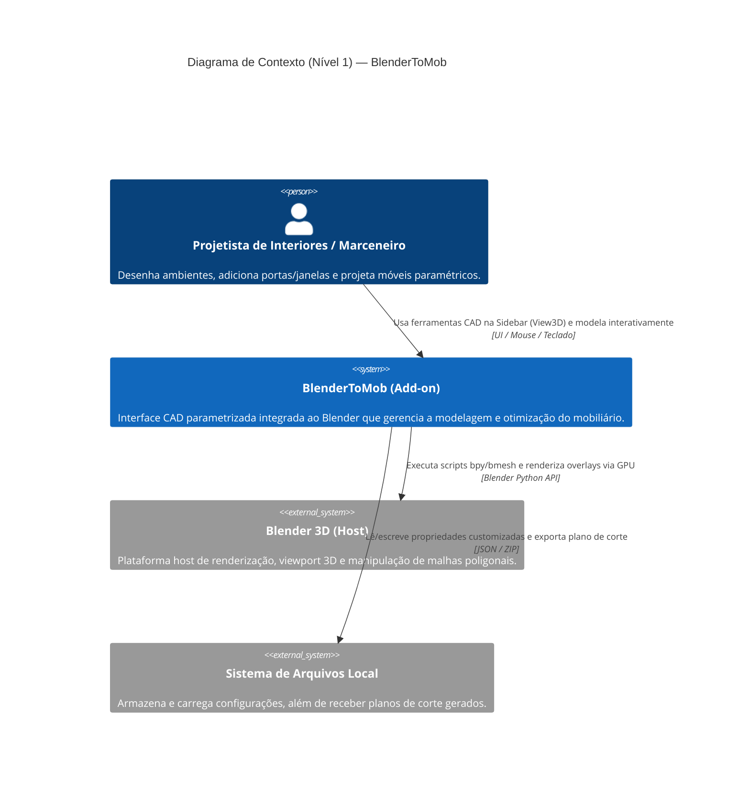
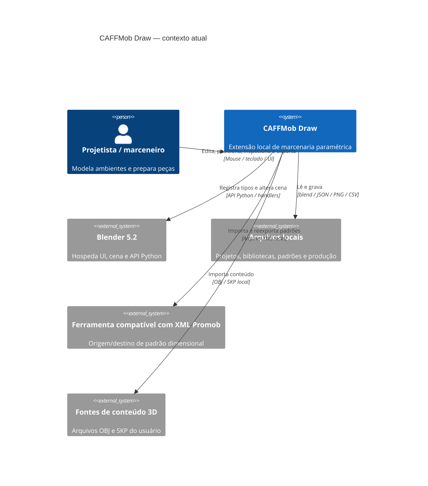

```mermaid
C4Context
    title Diagrama de Contexto (Nível 1) — BlenderToMob

    Person(designer, "Projetista de Interiores / Marceneiro", "Desenha ambientes, adiciona portas/janelas e projeta móveis paramétricos.")
    System(blendertomob, "BlenderToMob (Add-on)", "Interface CAD parametrizada integrada ao Blender que gerencia a modelagem e otimização do mobiliário.")
    System_Ext(blender, "Blender 3D (Host)", "Plataforma host de renderização, viewport 3D e manipulação de malhas poligonais.")
    System_Ext(filesystem, "Sistema de Arquivos Local", "Armazena e carrega configurações, além de receber planos de corte gerados.")

    Rel(designer, blendertomob, "Usa ferramentas CAD na Sidebar (View3D) e modela interativamente", "UI / Mouse / Teclado")
    Rel(blendertomob, blender, "Executa scripts bpy/bmesh e renderiza overlays via GPU", "Blender Python API")
    Rel(blendertomob, filesystem, "Lê/escreve propriedades customizadas e exporta plano de corte", "JSON / ZIP")
```

## Re-extração 2026-10-10 — arquitetura atual

🟢 Contexto atual. Integrações por arquivo não são APIs de servidores externos.

```mermaid
C4Context
    title CAFFMob Draw — contexto atual
    Person(projetista, "Projetista / marceneiro", "Modela ambientes e prepara peças")
    System(ext, "CAFFMob Draw", "Extensão local de marcenaria paramétrica")
    System_Ext(host, "Blender 5.2", "Hospeda UI, cena e API Python")
    System_Ext(arquivos, "Arquivos locais", "Projetos, bibliotecas, padrões e produção")
    System_Ext(promob, "Ferramenta compatível com XML Promob", "Origem/destino de padrão dimensional")
    System_Ext(conteudo, "Fontes de conteúdo 3D", "Arquivos OBJ e SKP do usuário")
    Rel(projetista, ext, "Edita, posiciona, inspeciona e exporta", "Mouse / teclado / UI")
    Rel(ext, host, "Registra tipos e altera cena", "API Python / handlers")
    Rel(ext, arquivos, "Lê e grava", "blend / JSON / PNG / CSV")
    Rel(ext, promob, "Importa e reexporta padrões", "Arquivo XML local")
    Rel(ext, conteudo, "Importa conteúdo", "OBJ / SKP local")
```
