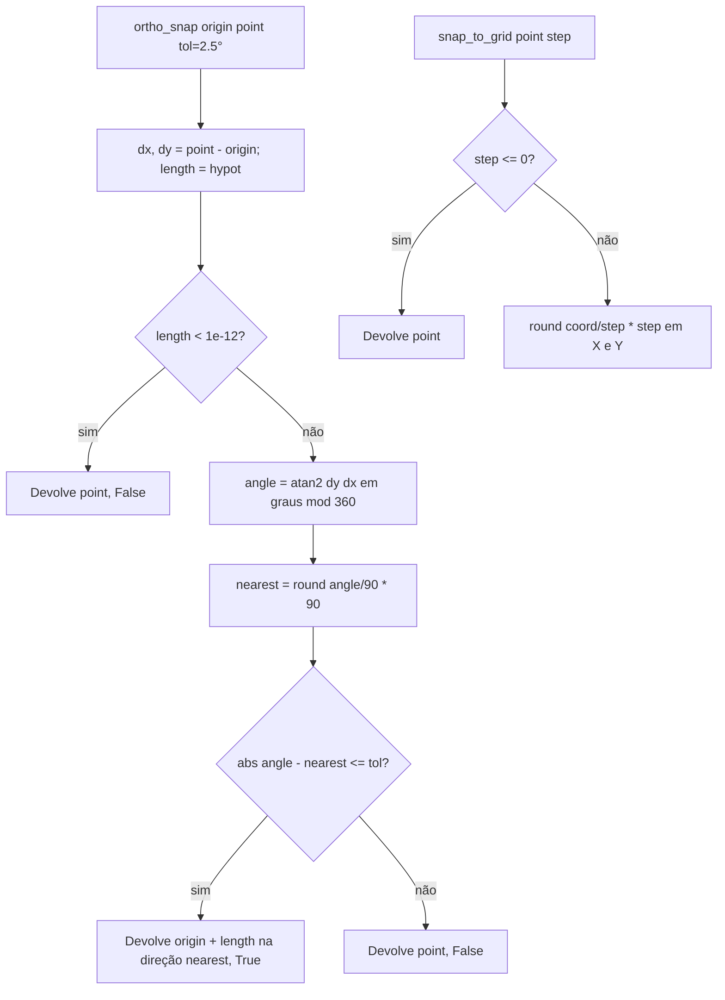

# Fluxograma: `ortho_snap` e `snap_to_grid` (canvas2d/view.py)

Encaixes puros usados pelo lápis do Editor de Paredes e pelo "Mover Sobre". Re-extração 2026-10.

```mermaid
flowchart TD
    A[ortho_snap origin point tol=2.5°] --> B[dx, dy = point - origin; length = hypot]
    B --> C{length < 1e-12?}
    C -- sim --> D[Devolve point, False]
    C -- não --> E[angle = atan2 dy dx em graus mod 360]
    E --> F[nearest = round angle/90 * 90]
    F --> G{abs angle - nearest <= tol?}
    G -- sim --> H[Devolve origin + length na direção nearest, True]
    G -- não --> D2[Devolve point, False]
    S[snap_to_grid point step] --> T{step <= 0?}
    T -- sim --> U[Devolve point]
    T -- não --> V[round coord/step * step em X e Y]
```
