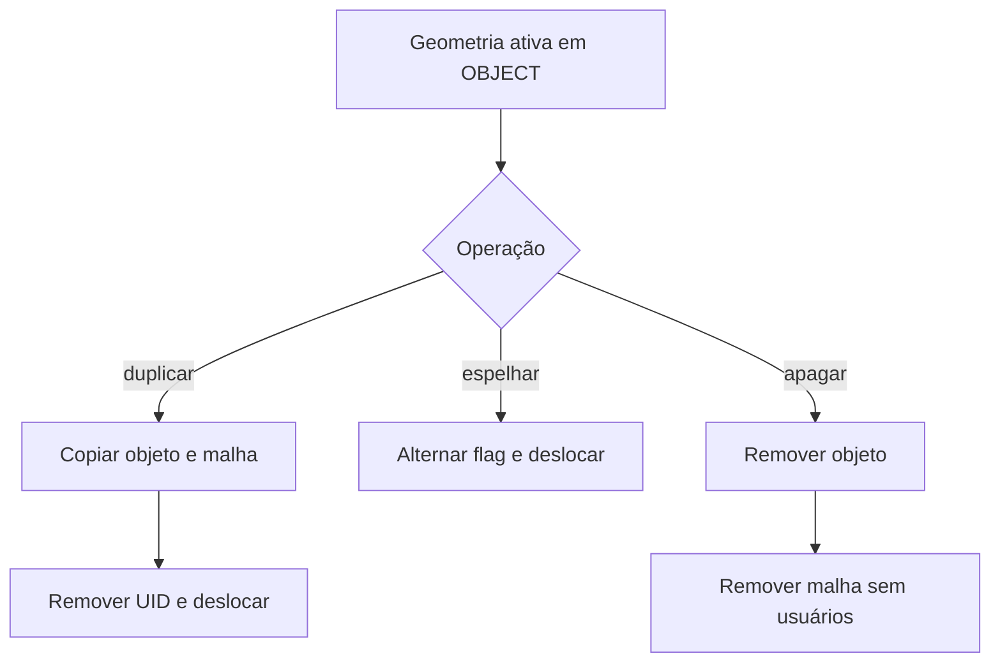

# Editar geometria livre

🟢 **CONFIRMADO** — caffmob_draw/geometry_free/ops_edit.py. Extração: 2026-10-10.

```mermaid
flowchart TD
A[Geometria ativa em OBJECT] --> B{Operação}
B -->|duplicar| C[Copiar objeto e malha]
C --> D[Remover UID e deslocar]
B -->|espelhar| E[Alternar flag e deslocar]
B -->|apagar| F[Remover objeto]
F --> G[Remover malha sem usuários]
```

