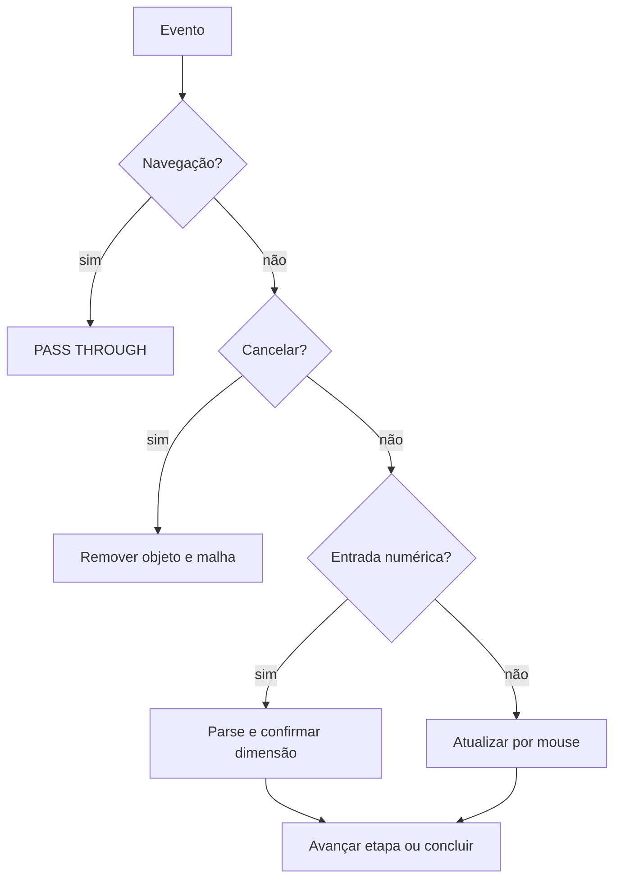

# Entrada modal de geometria

🟢 **CONFIRMADO** — caffmob_draw/geometry_free/ops_create.py:modal. Extração: 2026-10-10.

```mermaid
flowchart TD
A[Evento] --> B{Navegação?}
B -->|sim| C[PASS THROUGH]
B -->|não| D{Cancelar?}
D -->|sim| E[Remover objeto e malha]
D -->|não| F{Entrada numérica?}
F -->|sim| G[Parse e confirmar dimensão]
F -->|não| H[Atualizar por mouse]
G --> I[Avançar etapa ou concluir]
H --> I
```

