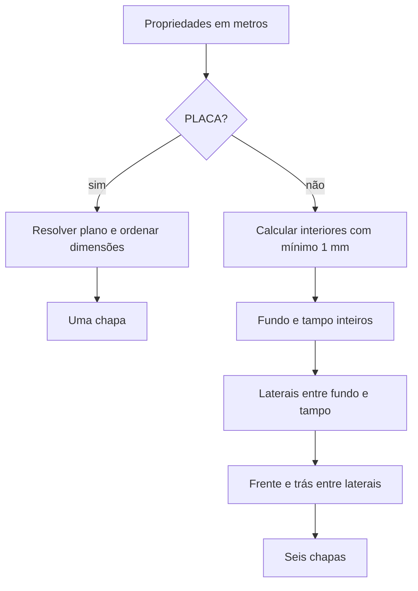

# Decompor chapas

🟢 **CONFIRMADO** — caffmob_draw/geometry_free/mesh.py:sheets. Extração: 2026-10-10.

```mermaid
flowchart TD
A[Propriedades em metros] --> B{PLACA?}
B -->|sim| C[Resolver plano e ordenar dimensões]
C --> D[Uma chapa]
B -->|não| E[Calcular interiores com mínimo 1 mm]
E --> F[Fundo e tampo inteiros]
F --> G[Laterais entre fundo e tampo]
G --> H[Frente e trás entre laterais]
H --> I[Seis chapas]
```

