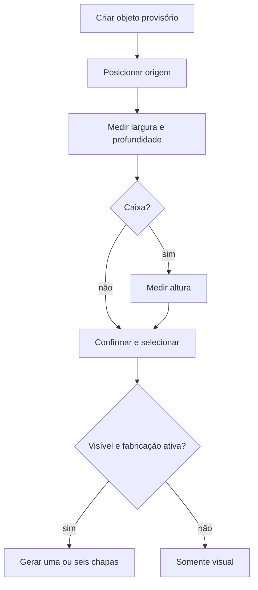

# Geometria livre: criação e produção

🟢 **CONFIRMADO** — caffmob_draw/geometry_free/ops_create.py/mesh.py. Extração: 2026-10-10.

```mermaid
flowchart TD
A[Criar objeto provisório] --> B[Posicionar origem]
B --> C[Medir largura e profundidade]
C --> D{Caixa?}
D -->|sim| E[Medir altura]
D -->|não| F[Confirmar e selecionar]
E --> F
F --> G{Visível e fabricação ativa?}
G -->|sim| H[Gerar uma ou seis chapas]
G -->|não| I[Somente visual]
```

