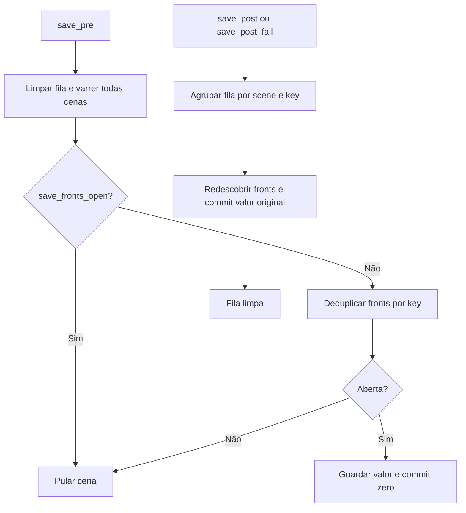

# Salvar fechado e restaurar vista

🟢 **CONFIRMADO** — inspection/save_guard.py:21–91. Extração: 2026-10-10.

```mermaid
flowchart TD
 A[save_pre] --> B[Limpar fila e varrer todas cenas]
 B --> C{save_fronts_open?}
 C -->|Sim| D[Pular cena]
 C -->|Não| E[Deduplicar fronts por key]
 E --> F{Aberta?}
 F -->|Sim| G[Guardar valor e commit zero]
 F -->|Não| D
 H[save_post ou save_post_fail] --> I[Agrupar fila por scene e key]
 I --> J[Redescobrir fronts e commit valor original]
 J --> K[Fila limpa]
```

