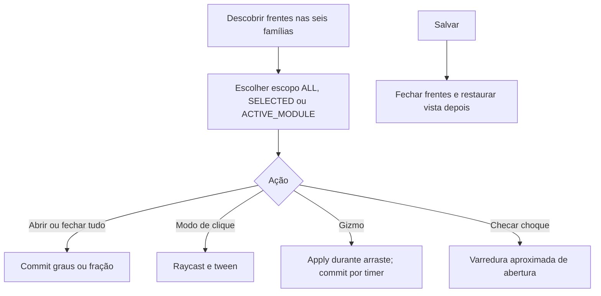

# Inspeção por adaptadores

🟢 **CONFIRMADO** — inspection/fronts.py:93–128; ops_inspect.py:36–92. Extração: 2026-10-10.

```mermaid
flowchart TD
 A[Descobrir frentes nas seis famílias] --> B[Escolher escopo ALL, SELECTED ou ACTIVE_MODULE]
 B --> C{Ação}
 C -->|Abrir ou fechar tudo| D[Commit graus ou fração]
 C -->|Modo de clique| E[Raycast e tween]
 C -->|Gizmo| F[Apply durante arraste; commit por timer]
 C -->|Checar choque| G[Varredura aproximada de abertura]
 H[Salvar] --> I[Fechar frentes e restaurar vista depois]
```

