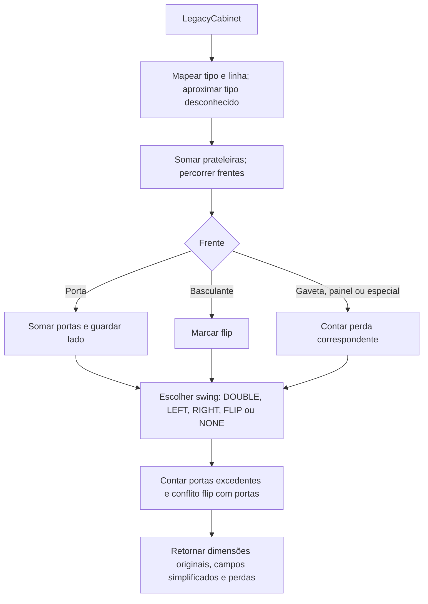

# Tradução do armário e contagem de perdas

🟢 **CONFIRMADO** — legacy/convert_core.py:43–103. Extração: 2026-10-10.

```mermaid
flowchart TD
 A[LegacyCabinet] --> B[Mapear tipo e linha; aproximar tipo desconhecido]
 B --> C[Somar prateleiras; percorrer frentes]
 C --> D{Frente}
 D -->|Porta| E[Somar portas e guardar lado]
 D -->|Basculante| F[Marcar flip]
 D -->|Gaveta, painel ou especial| G[Contar perda correspondente]
 E --> H[Escolher swing: DOUBLE, LEFT, RIGHT, FLIP ou NONE]
 F --> H
 G --> H
 H --> I[Contar portas excedentes e conflito flip com portas]
 I --> J[Retornar dimensões originais, campos simplificados e perdas]
```

