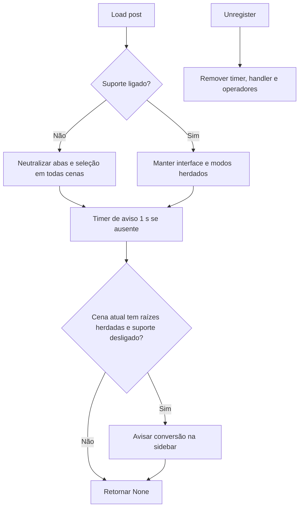

# Porta e ciclo de vida legado

🟢 **CONFIRMADO** — legacy/__init__.py:19–73; gate.py:13–47; ops.py:24–34. Extração: 2026-10-10.

```mermaid
flowchart TD
 A[Load post] --> B{Suporte ligado?}
 B -->|Não| C[Neutralizar abas e seleção em todas cenas]
 B -->|Sim| D[Manter interface e modos herdados]
 C --> E[Timer de aviso 1 s se ausente]
 D --> E
 E --> F{Cena atual tem raízes herdadas e suporte desligado?}
 F -->|Sim| G[Avisar conversão na sidebar]
 F -->|Não| H[Retornar None]
 G --> H
 I[Unregister] --> J[Remover timer, handler e operadores]
```

