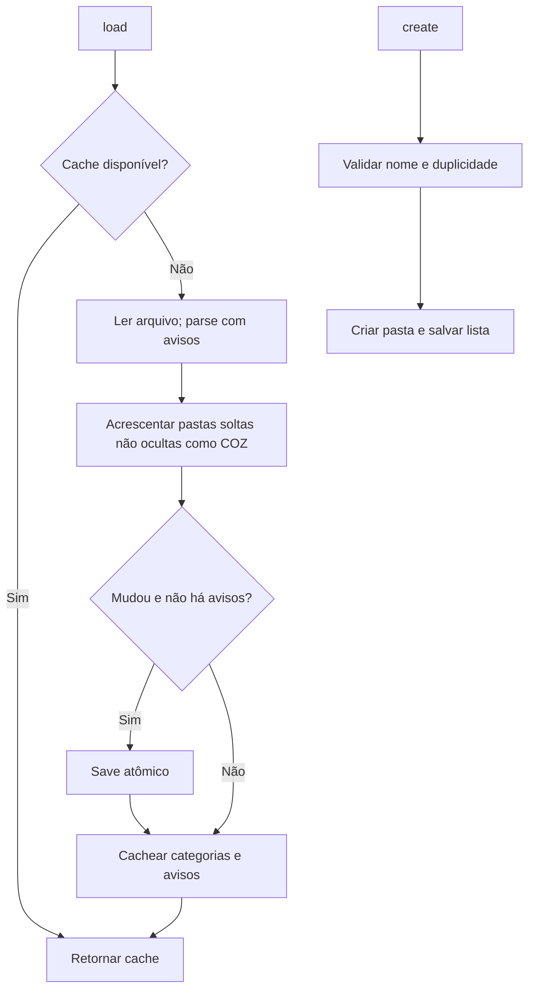

# Leitura e migração de categorias

🟢 **CONFIRMADO** — library_panel/categories.py:33–73; categories_core.py:51–95. Extração: 2026-10-10.

```mermaid
flowchart TD
 A[load] --> B{Cache disponível?}
 B -->|Sim| C[Retornar cache]
 B -->|Não| D[Ler arquivo; parse com avisos]
 D --> E[Acrescentar pastas soltas não ocultas como COZ]
 E --> F{Mudou e não há avisos?}
 F -->|Sim| G[Save atômico]
 F -->|Não| H[Cachear categorias e avisos]
 G --> H
 H --> C
 I[create] --> J[Validar nome e duplicidade]
 J --> K[Criar pasta e salvar lista]
```

