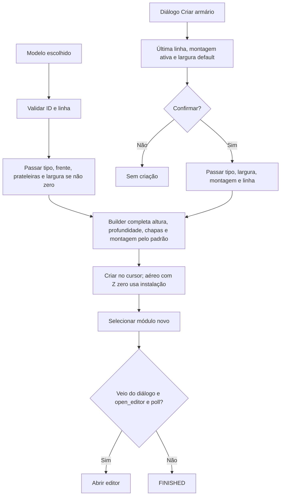

# Inserção de modelo e criação de armário

🟢 **CONFIRMADO** — library_panel/popover.py:65–80; ops_cabinet.py:42–70; operators/cabinet_builder.py:86–117. Extração: 2026-10-10.

```mermaid
flowchart TD
 A[Modelo escolhido] --> B[Validar ID e linha]
 B --> C[Passar tipo, frente, prateleiras e largura se não zero]
 D[Diálogo Criar armário] --> E[Última linha, montagem ativa e largura default]
 E --> F{Confirmar?}
 F -->|Não| G[Sem criação]
 F -->|Sim| H[Passar tipo, largura, montagem e linha]
 C --> I[Builder completa altura, profundidade, chapas e montagem pelo padrão]
 H --> I
 I --> J[Criar no cursor; aéreo com Z zero usa instalação]
 J --> K[Selecionar módulo novo]
 K --> L{Veio do diálogo e open_editor e poll?}
 L -->|Sim| M[Abrir editor]
 L -->|Não| N[FINISHED]
```

