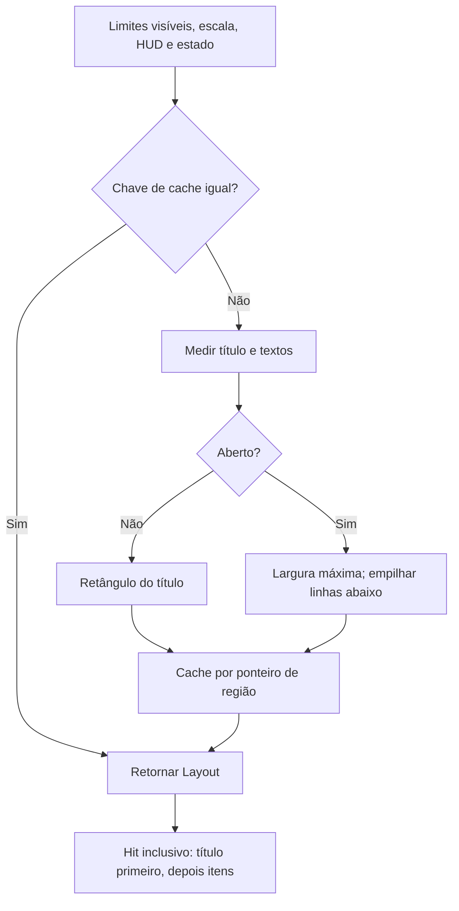

# Layout e hit test compartilhados

🟢 **CONFIRMADO** — library_panel/layout_core.py:39–79; draw.py:62–77. Extração: 2026-10-10.

```mermaid
flowchart TD
 A[Limites visíveis, escala, HUD e estado] --> B{Chave de cache igual?}
 B -->|Sim| C[Retornar Layout]
 B -->|Não| D[Medir título e textos]
 D --> E{Aberto?}
 E -->|Não| F[Retângulo do título]
 E -->|Sim| G[Largura máxima; empilhar linhas abaixo]
 F --> H[Cache por ponteiro de região]
 G --> H
 H --> C
 C --> I[Hit inclusivo: título primeiro, depois itens]
```

