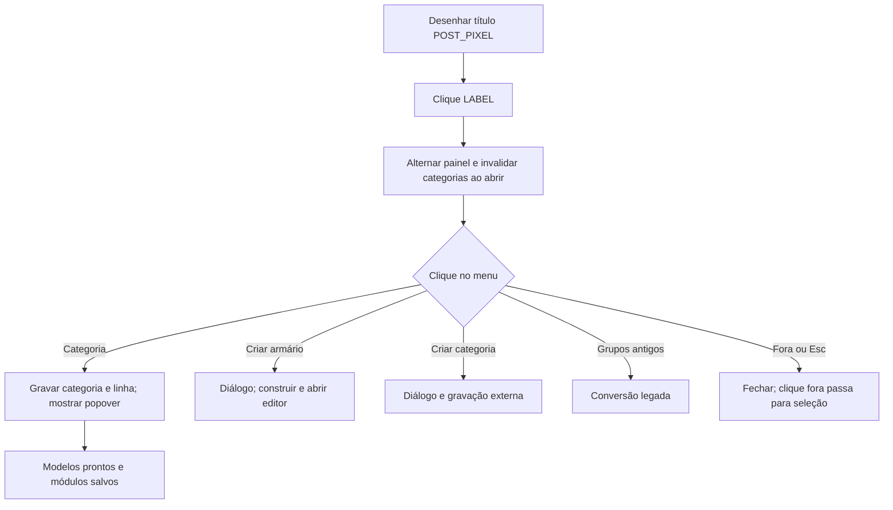

# Biblioteca CAFFMob na viewport

🟢 **CONFIRMADO** — library_panel/ops_click.py:35–77; popover.py:20–80. Extração: 2026-10-10.

```mermaid
flowchart TD
 A[Desenhar título POST_PIXEL] --> B[Clique LABEL]
 B --> C[Alternar painel e invalidar categorias ao abrir]
 C --> D{Clique no menu}
 D -->|Categoria| E[Gravar categoria e linha; mostrar popover]
 D -->|Criar armário| F[Diálogo; construir e abrir editor]
 D -->|Criar categoria| G[Diálogo e gravação externa]
 D -->|Grupos antigos| H[Conversão legada]
 E --> I[Modelos prontos e módulos salvos]
 D -->|Fora ou Esc| J[Fechar; clique fora passa para seleção]
```

