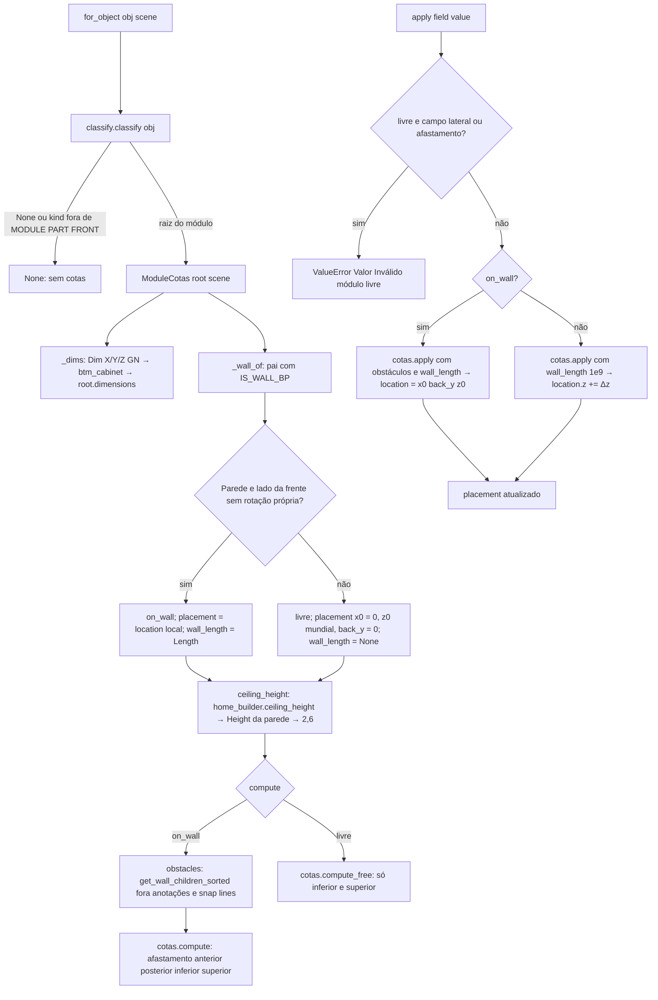
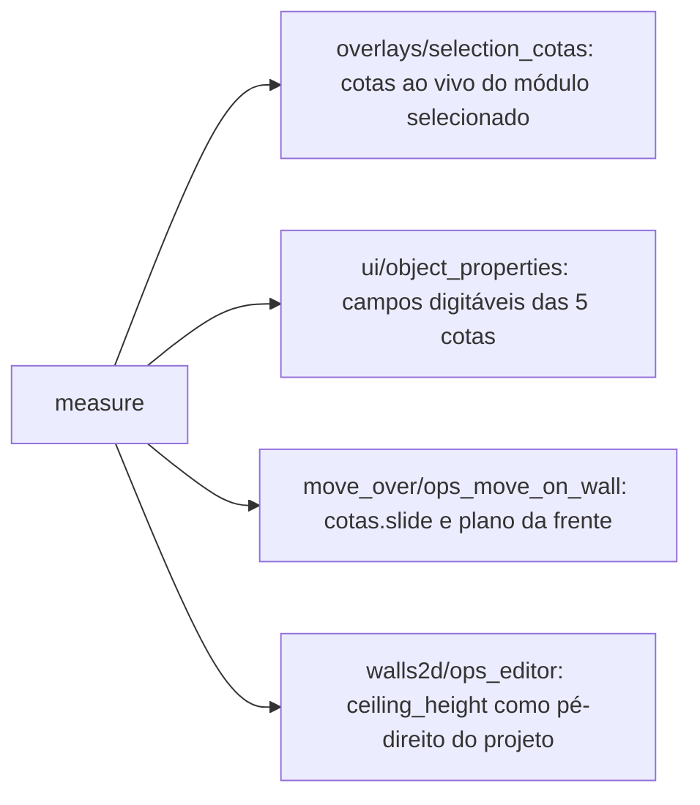

# Fluxograma do Módulo: measure

Cotas de módulo (`caffmob_draw/measure/`), nível **Detalhado**. Re-extração 2026-10 (Fase 2c).

## 1. Ler e aplicar uma cota

```mermaid
flowchart TD
    A[for_object obj scene] --> B[classify.classify obj]
    B -- None ou kind fora de MODULE PART FRONT --> C[None: sem cotas]
    B -- raiz do módulo --> D[ModuleCotas root scene]
    D --> E[_dims: Dim X/Y/Z GN → btm_cabinet → root.dimensions]
    D --> F[_wall_of: pai com IS_WALL_BP]
    F --> G{Parede e lado da frente sem rotação própria?}
    G -- sim --> H[on_wall; placement = location local; wall_length = Length]
    G -- não --> I[livre; placement x0 = 0, z0 mundial, back_y = 0; wall_length = None]
    H --> J[ceiling_height: home_builder.ceiling_height → Height da parede → 2,6]
    I --> J
    J --> K{compute}
    K -- on_wall --> L[obstacles: get_wall_children_sorted fora anotações e snap lines]
    L --> M[cotas.compute: afastamento anterior posterior inferior superior]
    K -- livre --> N[cotas.compute_free: só inferior e superior]
    O[apply field value] --> P{livre e campo lateral ou afastamento?}
    P -- sim --> Q[ValueError Valor Inválido módulo livre]
    P -- não --> R{on_wall?}
    R -- sim --> S[cotas.apply com obstáculos e wall_length → location = x0 back_y z0]
    R -- não --> T[cotas.apply com wall_length 1e9 → location.z += Δz]
    S --> U[placement atualizado]
    T --> U
```

## 2. Quem consome

```mermaid
flowchart LR
    M[measure] --> O[overlays/selection_cotas: cotas ao vivo do módulo selecionado]
    M --> U[ui/object_properties: campos digitáveis das 5 cotas]
    M --> W[move_over/ops_move_on_wall: cotas.slide e plano da frente]
    M --> E[walls2d/ops_editor: ceiling_height como pé-direito do projeto]
```
