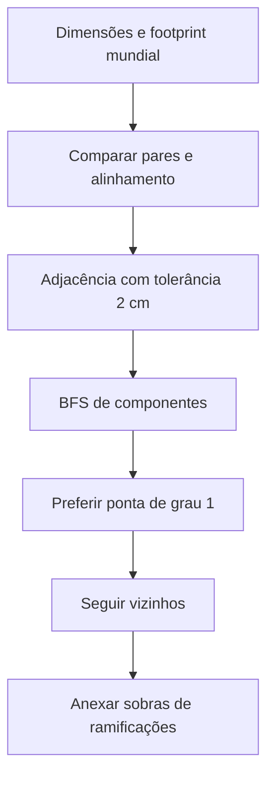

# Agrupar armários

🟢 **CONFIRMADO** — caffmob_draw/molding/engine.py:connected_components/order_chain. Extração: 2026-10-10.

```mermaid
flowchart TD
A[Dimensões e footprint mundial] --> B[Comparar pares e alinhamento]
B --> C[Adjacência com tolerância 2 cm]
C --> D[BFS de componentes]
D --> E[Preferir ponta de grau 1]
E --> F[Seguir vizinhos]
F --> G[Anexar sobras de ramificações]
```

