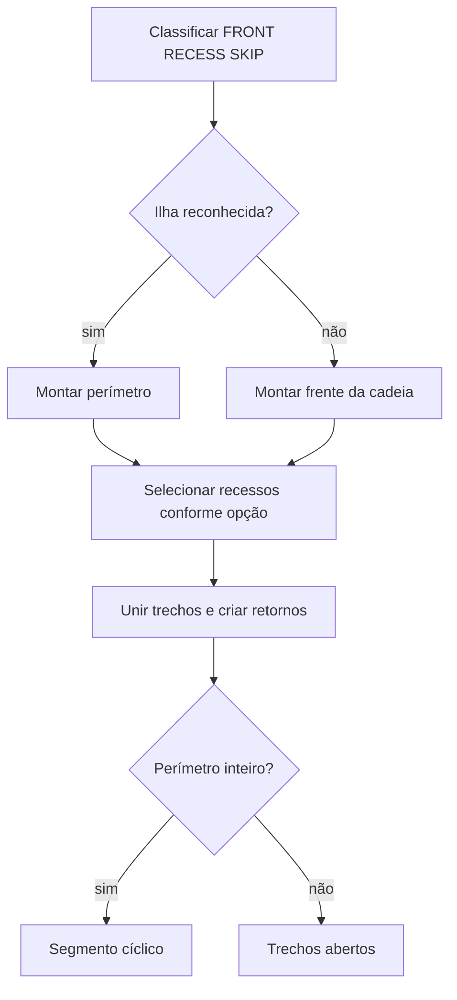

# Segmentar rodapés

🟢 **CONFIRMADO** — caffmob_draw/molding/engine.py:kick_sweep_segments. Extração: 2026-10-10.

```mermaid
flowchart TD
A[Classificar FRONT RECESS SKIP] --> B{Ilha reconhecida?}
B -->|sim| C[Montar perímetro]
B -->|não| D[Montar frente da cadeia]
C --> E[Selecionar recessos conforme opção]
D --> E
E --> F[Unir trechos e criar retornos]
F --> G{Perímetro inteiro?}
G -->|sim| H[Segmento cíclico]
G -->|não| I[Trechos abertos]
```

