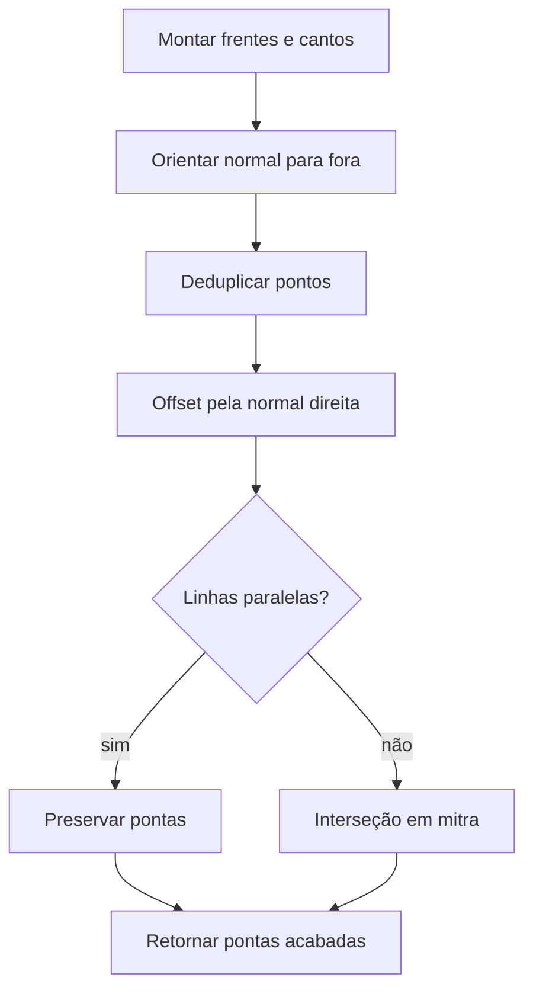

# Deslocar percurso

🟢 **CONFIRMADO** — caffmob_draw/molding/engine.py:chain_sweep_points/offset_polyline_right. Extração: 2026-10-10.

```mermaid
flowchart TD
A[Montar frentes e cantos] --> B[Orientar normal para fora]
B --> C[Deduplicar pontos]
C --> D[Offset pela normal direita]
D --> E{Linhas paralelas?}
E -->|sim| F[Preservar pontas]
E -->|não| G[Interseção em mitra]
F --> H[Retornar pontas acabadas]
G --> H
```

