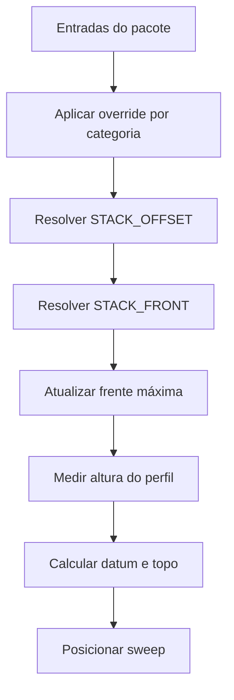

# Resolver pilha de perfis

🟢 **CONFIRMADO** — caffmob_draw/molding/ops.py:_resolve_stack/_sweep_z. Extração: 2026-10-10.

```mermaid
flowchart TD
A[Entradas do pacote] --> B[Aplicar override por categoria]
B --> C[Resolver STACK_OFFSET]
C --> D[Resolver STACK_FRONT]
D --> E[Atualizar frente máxima]
E --> F[Medir altura do perfil]
F --> G[Calcular datum e topo]
G --> H[Posicionar sweep]
```

