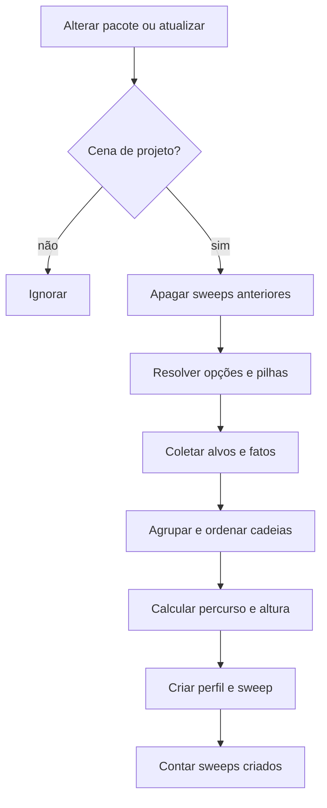

# Aplicar molduras da cena

🟢 **CONFIRMADO** — caffmob_draw/molding/ops.py:apply_scene_packages. Extração: 2026-10-10.

```mermaid
flowchart TD
A[Alterar pacote ou atualizar] --> B{Cena de projeto?}
B -->|não| X[Ignorar]
B -->|sim| C[Apagar sweeps anteriores]
C --> D[Resolver opções e pilhas]
D --> E[Coletar alvos e fatos]
E --> F[Agrupar e ordenar cadeias]
F --> G[Calcular percurso e altura]
G --> H[Criar perfil e sweep]
H --> I[Contar sweeps criados]
```

