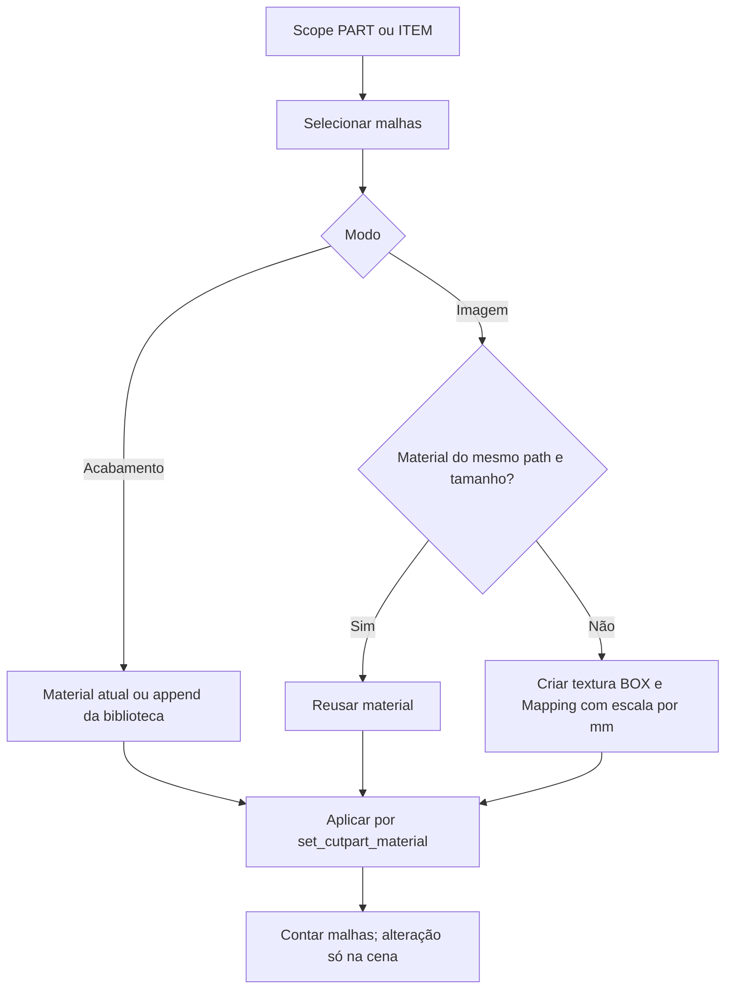

# Acabamento e textura própria

🟢 **CONFIRMADO** — object_library/retexture.py:31–99. Extração: 2026-10-10.

```mermaid
flowchart TD
 A[Scope PART ou ITEM] --> B[Selecionar malhas]
 B --> C{Modo}
 C -->|Acabamento| D[Material atual ou append da biblioteca]
 C -->|Imagem| E{Material do mesmo path e tamanho?}
 E -->|Sim| F[Reusar material]
 E -->|Não| G[Criar textura BOX e Mapping com escala por mm]
 D --> H[Aplicar por set_cutpart_material]
 F --> H
 G --> H
 H --> I[Contar malhas; alteração só na cena]
```

