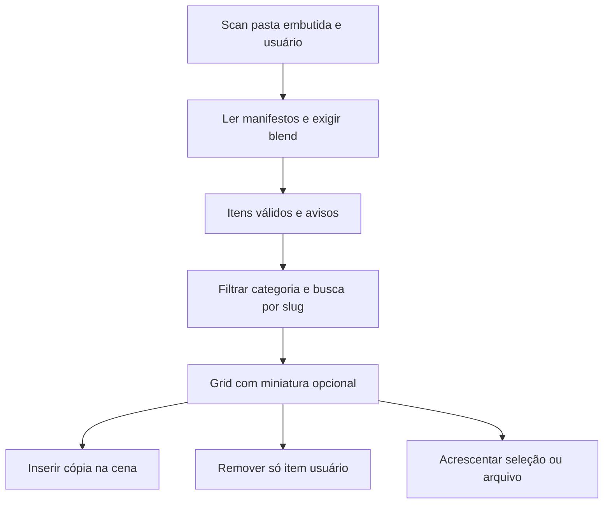

# Biblioteca de objetos embutidos e do usuário

🟢 **CONFIRMADO** — object_library/store.py:30–68; panels.py:14–44. Extração: 2026-10-10.

```mermaid
flowchart TD
 A[Scan pasta embutida e usuário] --> B[Ler manifestos e exigir blend]
 B --> C[Itens válidos e avisos]
 C --> D[Filtrar categoria e busca por slug]
 D --> E[Grid com miniatura opcional]
 E --> F[Inserir cópia na cena]
 E --> G[Remover só item usuário]
 E --> H[Acrescentar seleção ou arquivo]
```

