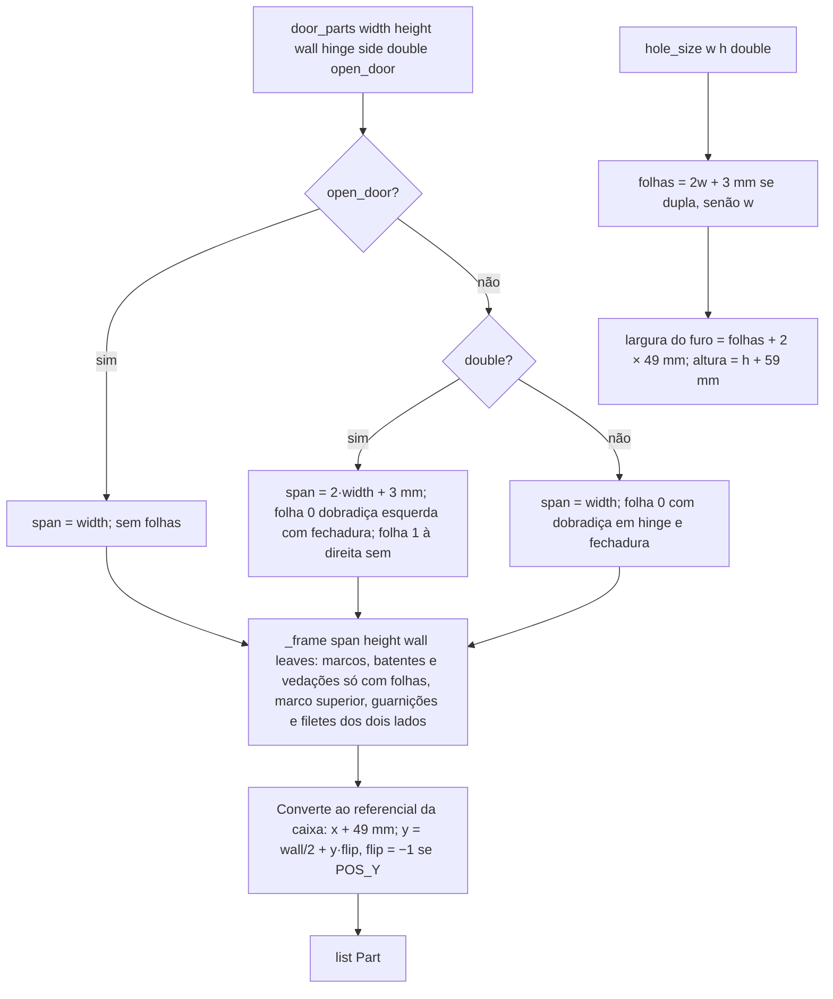
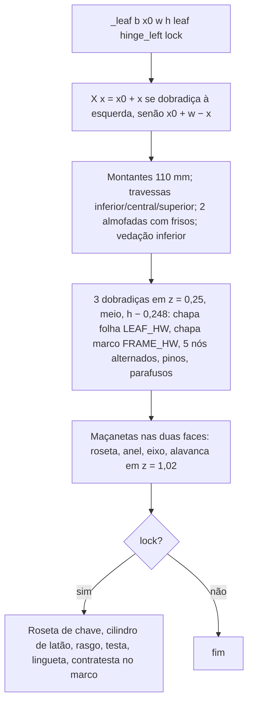
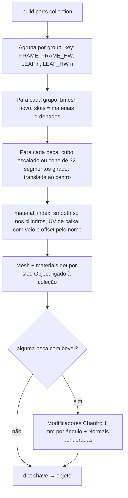

# Fluxograma: `door_core.door_parts`, `hole_size` e `build.build` (openings)

Gerador paramétrico da porta de giro e montagem em poucas malhas.

```mermaid
flowchart TD
    A[door_parts width height wall hinge side double open_door] --> B{open_door?}
    B -- sim --> C[span = width; sem folhas]
    B -- não --> D{double?}
    D -- sim --> E[span = 2·width + 3 mm; folha 0 dobradiça esquerda com fechadura; folha 1 à direita sem]
    D -- não --> F[span = width; folha 0 com dobradiça em hinge e fechadura]
    C --> G[_frame span height wall leaves: marcos, batentes e vedações só com folhas, marco superior, guarnições e filetes dos dois lados]
    E --> G
    F --> G
    G --> H[Converte ao referencial da caixa: x + 49 mm; y = wall/2 + y·flip, flip = −1 se POS_Y]
    H --> I[list Part]
    J[hole_size w h double] --> K[folhas = 2w + 3 mm se dupla, senão w]
    K --> L[largura do furo = folhas + 2 × 49 mm; altura = h + 59 mm]
```

```mermaid
flowchart TD
    A[_leaf b x0 w h leaf hinge_left lock] --> B[X x = x0 + x se dobradiça à esquerda, senão x0 + w − x]
    B --> C[Montantes 110 mm; travessas inferior/central/superior; 2 almofadas com frisos; vedação inferior]
    C --> D[3 dobradiças em z = 0,25, meio, h − 0,248: chapa folha LEAF_HW, chapa marco FRAME_HW, 5 nós alternados, pinos, parafusos]
    D --> E[Maçanetas nas duas faces: roseta, anel, eixo, alavanca em z = 1,02]
    E --> F{lock?}
    F -- sim --> G[Roseta de chave, cilindro de latão, rasgo, testa, lingueta, contratesta no marco]
    F -- não --> H[fim]
```

```mermaid
flowchart TD
    A[build parts collection] --> B[Agrupa por group_key: FRAME, FRAME_HW, LEAF n, LEAF_HW n]
    B --> C[Para cada grupo: bmesh novo, slots = materiais ordenados]
    C --> D[Para cada peça: cubo escalado ou cone de 32 segmentos girado; translada ao centro]
    D --> E[material_index, smooth só nos cilindros, UV de caixa com veio e offset pelo nome]
    E --> F[Mesh + materials.get por slot; Object ligado à coleção]
    F --> G{alguma peça com bevel?}
    G -- sim --> H[Modificadores Chanfro 1 mm por ângulo + Normais ponderadas]
    G -- não --> I
    H --> I[dict chave → objeto]
```
