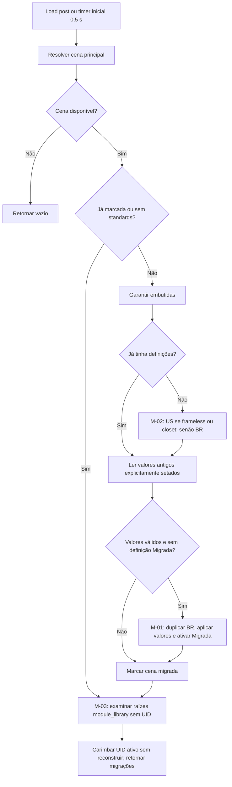

# Migrações M-01, M-02 e M-03

🟢 **CONFIRMADO** — fontes: `standards/migration.py:54–154; caffmob_draw/__init__.py:99`. Extração: 2026-10-10.

```mermaid
flowchart TD
    A[Load post ou timer inicial 0,5 s] --> B[Resolver cena principal]
    B --> C{Cena disponível?}
    C -->|Não| D[Retornar vazio]
    C -->|Sim| E{Já marcada ou sem standards?}
    E -->|Sim| K[M-03: examinar raízes module_library sem UID]
    E -->|Não| F[Garantir embutidas]
    F --> G{Já tinha definições?}
    G -->|Não| H[M-02: US se frameless ou closet; senão BR]
    G -->|Sim| I[Ler valores antigos explicitamente setados]
    H --> I
    I --> J{Valores válidos e sem definição Migrada?}
    J -->|Sim| L[M-01: duplicar BR, aplicar valores e ativar Migrada]
    J -->|Não| M[Marcar cena migrada]
    L --> M
    M --> K
    K --> N[Carimbar UID ativo sem reconstruir; retornar migrações]
```
