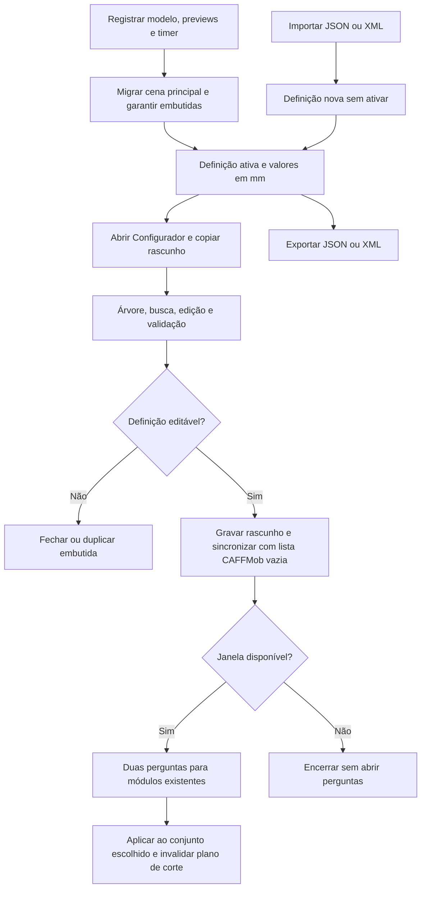

# Fluxo do Padrão de Dimensões

🟢 **CONFIRMADO** — fontes: `standards/__init__.py:20–27; api.py:241–319; operators/ops_standards.py:122–240`. Extração: 2026-10-10.

```mermaid
flowchart TD
    A[Registrar modelo, previews e timer] --> B[Migrar cena principal e garantir embutidas]
    B --> C[Definição ativa e valores em mm]
    C --> D[Abrir Configurador e copiar rascunho]
    D --> E[Árvore, busca, edição e validação]
    E --> F{Definição editável?}
    F -->|Não| G[Fechar ou duplicar embutida]
    F -->|Sim| H[Gravar rascunho e sincronizar com lista CAFFMob vazia]
    H --> I{Janela disponível?}
    I -->|Sim| J[Duas perguntas para módulos existentes]
    I -->|Não| K[Encerrar sem abrir perguntas]
    C --> L[Exportar JSON ou XML]
    M[Importar JSON ou XML] --> N[Definição nova sem ativar]
    N --> C
    J --> O[Aplicar ao conjunto escolhido e invalidar plano de corte]
```
