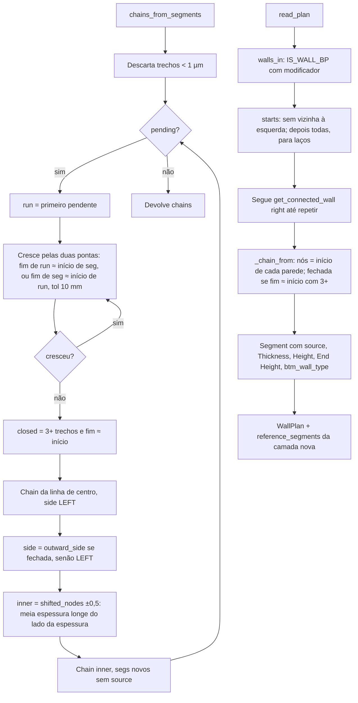

# Fluxograma: `convert.chains_from_segments` e `scene_io.read_plan` (walls2d)

```mermaid
flowchart TD
    A[chains_from_segments] --> B[Descarta trechos < 1 µm]
    B --> C{pending?}
    C -- sim --> D[run = primeiro pendente]
    D --> E[Cresce pelas duas pontas: fim de run ≈ início de seg, ou fim de seg ≈ início de run, tol 10 mm]
    E --> F{cresceu?}
    F -- sim --> E
    F -- não --> G[closed = 3+ trechos e fim ≈ início]
    G --> H[Chain da linha de centro, side LEFT]
    H --> I[side = outward_side se fechada, senão LEFT]
    I --> J[inner = shifted_nodes ±0,5: meia espessura longe do lado da espessura]
    J --> K[Chain inner, segs novos sem source]
    K --> C
    C -- não --> L[Devolve chains]

    R[read_plan] --> S[walls_in: IS_WALL_BP com modificador]
    S --> T[starts: sem vizinha à esquerda; depois todas, para laços]
    T --> U[Segue get_connected_wall right até repetir]
    U --> V[_chain_from: nós = início de cada parede; fechada se fim ≈ início com 3+]
    V --> W[Segment com source, Thickness, Height, End Height, btm_wall_type]
    W --> X[WallPlan + reference_segments da camada nova]
```
