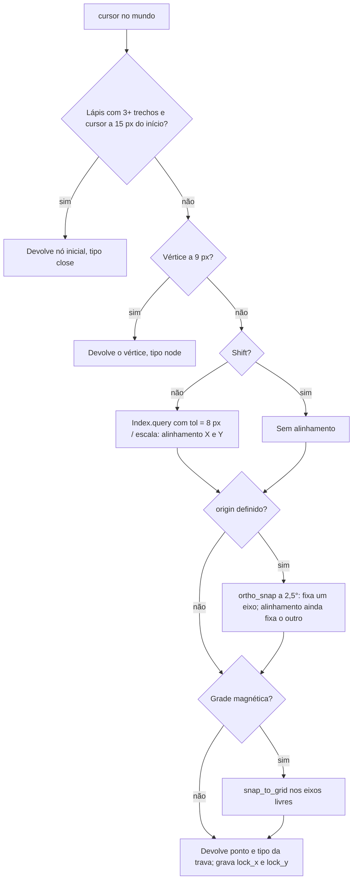

# Fluxograma: `resolve_point` (walls2d/ops_editor.py)

Cadeia única de travas da mira (009, RN-03, D-02).

```mermaid
flowchart TD
    A[cursor no mundo] --> B{Lápis com 3+ trechos e cursor a 15 px do início?}
    B -- sim --> C[Devolve nó inicial, tipo close]
    B -- não --> D{Vértice a 9 px?}
    D -- sim --> E[Devolve o vértice, tipo node]
    D -- não --> F{Shift?}
    F -- não --> G[Index.query com tol = 8 px / escala: alinhamento X e Y]
    F -- sim --> H[Sem alinhamento]
    G --> I{origin definido?}
    H --> I
    I -- sim --> J[ortho_snap a 2,5°: fixa um eixo; alinhamento ainda fixa o outro]
    I -- não --> K
    J --> K{Grade magnética?}
    K -- sim --> L[snap_to_grid nos eixos livres]
    K -- não --> M[Devolve ponto e tipo da trava; grava lock_x e lock_y]
    L --> M
```
